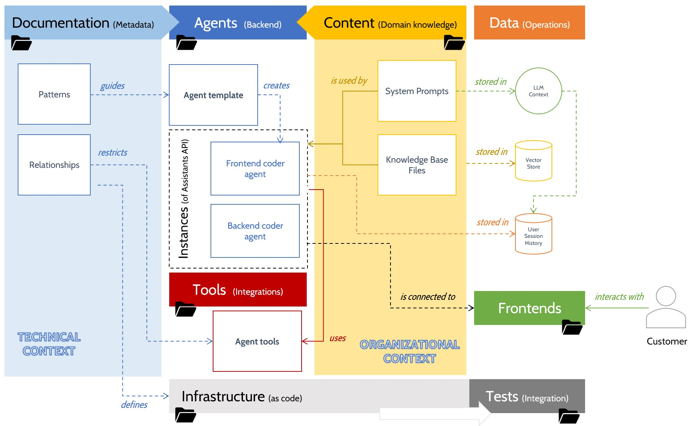
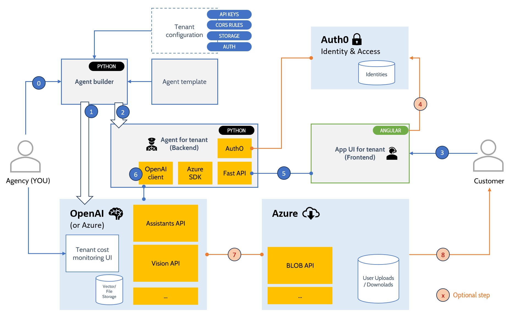

# Well-architected framework for AI agents

This project covers the automated creation and maintenance of AI agents based upon the OpenAI APIs - esp. assistants API v2.

The plan is to grow documentation together with code in a 50%/50% ratio: Only if the textual description is precise and complete next generation LLMs will be able to modify the existing codebase with high precision.

# Use cases and scope
This project aims at a LEAST COST implemntation of agents for customers. The approach is to avoid use as many out-of-the-box services to simplify development.

Imagine you were a web agency and want to provide agents based solutions to your clients: 
* the implementations should not differ too much for easier maintenance/updates AND 
* you want to be able to separate operations costs per tenant AND
* you want to implement only the business logic, the rest should be covered by cloud services

# Logical dependencies: Repo folders
This repository is organized in the following structure:

* Documentation (first)
* Agents (the artifacts to be produced)
* Content (the business logic of the agents)
* Tools for internal use by agents (integrations with cloud services)
* Frontends

Operational data is distributed over the different cloud providers (like Azure, OpenAI). This is the tradeoff for the least cost approach. 

# Deployment view: Components

As initial step you create a backend and frontend combination for your agent. You provide the API keys,
credentials and other tenant specific configuration in a local file.

1. The assistant is created as an assistan instance within OpenAI with GPT-4 as model
2. The business logic will be placed in the agent created by the agent builder
3. The customer interacts with the frontend
4. (optional) the customer has to authenticate with Aut0 identity and access management
5. The UI interacts with the agent (backend) via API calls
6. The agend interacts with the OpenAI APIs as required and returns the responses back to the UI
7. If the user provides files or gets files as a response (e. g. a created Excel file) Azure BLOB storage is controlled by the agent using the Azure SDK. 
8. The customer can download files from the Azure cloud 

This is a simplified overview.

# Prerequisites
An API key for OpenAI with unrestricted permissions. This is required because the Python code will create objects like assistants and files.

# Out of scope

* Models
* Data sets for training

# Deployment scopes
Agents developed with this framework can be used either stand-alone or deployed into the Azure cloud.

# Status
Experimental

# License
MIT
