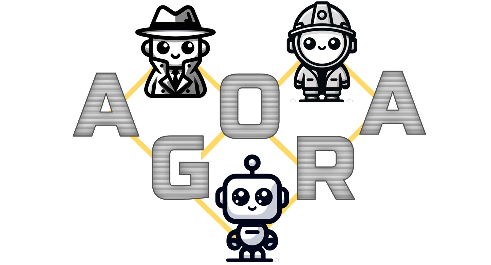

# AgentZ Agora
This project tries to answer the question "How can I SEND my agent to a agentic marketplace to interact with the agents of other people/companies?"

To answer this question the project has 3 main artifacts:

1. AGENT PACKAGE: The definition of an agent which can be sent via API/eMail

2. AGORA ENVIRONMENT: A Pyton script which creates an instance of the visiting agent and guides controlls the process of interaction with the other agents

3. UI TO MONITOR THE INTERACTIONS: A React web interface to see what's going on and to debug the prompts

The definition of an agent is based on the asumption that a agent's prompt consists of 3 parts:

1. SYSTEM PROMPT: Defines the way the agent interacts with the marketplace and how it proceeds within a conversation (called flow in this project)

2. TASK PROMPT: This is the task given by the user (without knowing anything about the marketplace semantics)

3. MEMORY PROMPT: The agent needs to remember certain states or conditions it has already encountered (e. g. to avoid infinite loops)

To start the project you run the flow-monitor-app and select an agent to run. Select "Xenos" to see how it works and then play around with it's definition or add other agents.

## Why is this called "Agora"?
Imagine we were in the ancient greece and you sent your husband down to the marketplace (called agora at this time) of a another town to get the town's famous pink olives. 

You would first tell him about the task ("Get 20 pink olives!") and then send him to the town ("Go to Heraklion!") - this is basically your agent's definition contained in an agent package.

The travel to Heraklion is the transmission of the package to the marketplace (or secure environment). Only greek cititzens are allowed to enter the marketplace there - this is enforced by the archon (=chief for security on the agora). This is the execution of the package in the environment (=run the the Python script with the agent's name as a parameter) after the package has been checked (e. g. valid credentials for the marketplace, check of digital signature).

If you were a outstanding person you could watch the interaction of the agents live on the agora as a bystander. As we are in a virtual world we need a UI to visualize all the interactions which can lead to three outcomes:
* the husband sucessfully buys the pink olives and heads home
* the husband cannot buy the olives and leaves the agora bare handed
* the husband dies from a allergic reaction to a olive he tasted (which is the infinte loop that might occur due to pre-mature LLM technology or insufficient prompting)

This project is an *experimental hub for agents to interact*. In contrast to other frameworks like LangGraph, AutoGen or CrewAI which are focused on dividing a complex initial task into subtasks and having those processed by different agents INSIDE a company AgentZ Agora connects agents of different companies within a controlled environment.

The idea is that an assistant (e. g. a custom GPT) sends an agent to some well-known Agoras in order to complete a task which involves another party.

## Sending an agent
A agent is not a binary package but a YAML manifest. The owner of the agent creates the manifest and encrypts and digitally signs it.

Examples can be found in the agents subfolder of this repository.

## Restricted Access (Trust)
The Agora cannot be entered by any agent. A agent manifest YAML is uploaded to the Agora and validated:
* is must be encrypted and signed
* the contained credentials for the Agora must be satisfied (e. g. valid passport number, customer id)

## Entry point
The agent first talks to the Archon agent which is the entry point for the Agora.

# Technology
* Supports agents based on Ollama3 (locally installed) or GTP-4 (cloud based)
* Uses LangChain under the hood to abstract LLM calls
* Is currently only for local usage (no cloud deployment available)

# How to start
After checkout got to the shell, switch to /frontends/react/flow-monitor/flow-monitor-app and type "npm run dev".

This starts the main UI and requires Ollama3 being started upfront.

## Example scenario
A customer agent XENOS has been sent to the Agora. His first contact is to talk to ARCHOS to get details about the available merchants.

Xenos is looking for some energy drinks. There are three merchants registered on the Agora: John, Martha and Jarvis.

If Xenos is successful he buys 3 cans of Monster energy from Jarvis.

# Status
Experimental
