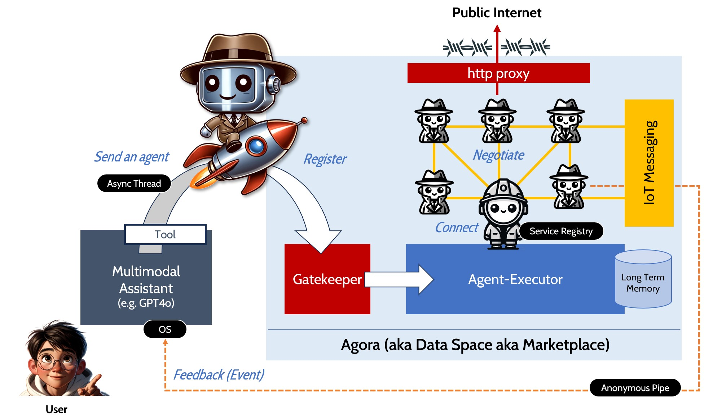

# AgentZ Agora
Agora is an experimental agent framework which is specialized in secure cross-company agent interaction.

## Positioning
As of June 2024 the following agentic frameworks are popular. They focus on one company being the owner of a crew of agents while deploying different orchestration methods. 

|-------------|----------|--------------------------------|-------------------|-----------------|
| Framework   | Scope    | LLMs supported                 | Orchestration     | Production readiness |
|-------------|----------|--------------------------------|-------------------|----------------------|
| AutoGen 2   | company internal | any                    | Conditional state flow (FSM guided conversation) | experimental |
| CrewAI      | company internal | any                    | Fixed processes (sequential, hierarchical), Consensual(Planned) not released | yes (product) |
| LangGraph   | company internal | any                    | Directed cyclic graphs | production ready | yes (base technology) |
| Agency Swarm  | company internal | OpenAI assistant API     | Self-orchestrated messaging | yes (product) |
| AgentZ Agora| **cross-company**| GPT4..., Ollama Llama 3| Planned state flow (FSM guided)| experimental |

## Problem Statement (Vision)
"As a user I want my personal assistant to be able to send agents to places I trust to act on my behalf."

This repository defines a trusted decentralized infrastructure (Agora) for agents of different users/parties/companies to interact.

Built with the following mindset:
* Construct everything to support privacy, trust and governance (TRUST FIRST)
* Use simple text manifests to create agents instead of binaries/direct web requests (KISS)
* Use existing infrastructure components from industrial environments (DON'T REINVENT THE WHEEL)
* Don't invent a new communication protocol and use LLM capabilities instead (INNOVATION)



The figure above contains some analogies from operating systems:
* An AI assistant is the OS (Operating System)
* The assistant can communicate via speech, vision and text directly with the user
* When there are tasks which require asynchronous operations with other IT systems the assistant uses a tool internally to send an agent (as asynchronous thread)
* The agent is deployed to a remote system (agora) and started with an PID (unique process id)
* As a first start of communication the agent talks to the archos agent (service registry) and can find other agents 
* Synchronous communication between the agents is facilitated by the agent-executor
* Asynchronous communication between agents is achieved by using MQTT messaging (IPC)
* Agents can use their own tools to access the internet if the agora's policies allow these connections (via the http proxy)
* To send feedback back to the OS the agent publishes a MQTT message to a private subject (which is the PID) - the OS can subscribe to this private anonymous pipe

This translates into the following technical components:


# Essential components of the agent definition


# Why do we need an agent executor?

In order to control and (in the worst case throttle or ban) agents it is necessary to have control over the agent on a very low level - this cannot be achieved if agents would be just URLs pointing to unknown services in the cloud.

This is the reason why the agent executor invokes the supported LLMs and monitors the responses (including tool usage).

The gatekeeper component can
* examine the agent manifest for malicious or inappropriate prompting
* verfify the identity of the owner 
* check whether the LLM models are supported (for security or cost reasons)
* whitelist URLs an agent wants to access on the public internet (via tools)

The agent executor component can
* control which agents talk to each other
* apply quotas or interrupt transactions (tool calls)
* parse the prompt a agent has created for the next agent during a conversation
* avoid infinite loops caused by unpredictable strategies applied by some agents
* control the costs for the provider of the agora (by enforcing quotas)

These aspects all build trust and thus are crucial if an agora is a marketplace for
* medical products
* validated members of a closed community
* items regulated by federal laws 
* legal services
* services for residents of a local community

# Maturity Level (Status)

| Phase  | Description | Achieved? | Executed on/in | Supported LLMs |
| ------------- | ------------- | --------| -----------|---|
| Feasibility Study  | Create the core components stand-alone in Python and a React UI | No | Local computer manually | GPT-4, Llama 3 |
| MVP  | Create connected core services with observability and admin UI  | No | Local computer scripted | GPT-4, Llama 3 |
| First release | Deployable product | No  |Cloud (Terraform) | TBD |

## Core components to understand
The ideas of the agora are centered around 3 main artifacts:

1. AGENT PACKAGE: The definition of an agent which can be sent via API call to the Gatekeeper component, the gatekeeper returns a PID as identifier

2. AGORA ENVIRONMENT: Two Python scripts (FastAPI backends). One is the gatekeeper and authenticates/authorizes agents to enter the agora. The other is the agent-executor which is the runtime powered by LangChain and similar technologies. 

3. UI TO MONITOR THE INTERACTIONS: A React web interface to see what's going on and to debug the prompts of the agentic flow.

The definition of an agent is based on the asumption that a agent's prompt consists of 3 parts:

1. SYSTEM PROMPT: Defines the way the agent interacts with the marketplace and how it proceeds within a conversation (called flow in this project)

2. TASK PROMPT: This is the task given by the user (without knowing anything about the marketplace semantics)

3. MEMORY PROMPT: The agent needs to remember certain states or conditions it has already encountered (e. g. to avoid infinite loops)

# Getting started

## Create an Python virtual environment and install the packages
```
python -m pip install -r requirements.txt
```

## Set the communication channels and agora instances
The MQTT broker allows the agents' owners to control their agents on the different agoras.

Create a .env file in the /agora folder:
```
MQTT_BROKER_URL=broker.hivemq.com
MQTT_BROKER_PORT=1883
AGORA_NAME=ralph
```

## Set the workspace folder
The workspace folder is the data store for all agent activities as well as the uploaded definitions.

Create a .env file in the /agora/agent_executor folder:
```
AGORA_WORKSPACE=C:/Data/GitHub/reign-over-robot/workspace/agoras
AGORA_AGENTS_REPOSITORY=C:/Data/GitHub/reign-over-robots/workspace/agents
```

## Start the services
Switch to the /agora/ folder and start 
```
start-agora.sh
```
This starts the backend services and the browser instance for the UI.

# Parts of the story
## Why is this called "Agora"?
Imagine we were in the ancient greece and you sent your husband down to the marketplace (called agora at this time) of a another town to get the town's famous pink olives. 

You would first tell him about the task ("Get 20 pink olives!") and then send him to the town ("Go to Heraklion!") - this is basically your agent's definition contained in an agent package.

Because your husband is easily distracted (like today's LLMs) you have to use all of you female envisioning power to describe the mission of your husband in a precise, non-intimidating and rewarding way. Meaning: Prompting is the key here for a successful agent...

The travel to Heraklion is the transmission of the agent manifest to the gatekeeper. Only greek cititzens are allowed to enter the marketplace in our case - this is enforced by the archon (=chief for security on the agora). The gatekeeper component checks the identity and allows the execution of the package in the environment. 

If you were a outstanding person you could watch the interaction of the agents live on the agora as a bystander. As we are in a virtual world we need a UI to visualize all the interactions which can lead to three outcomes:
* the husband sucessfully buys the pink olives and heads home
* the husband cannot buy the olives and leaves the agora bare handed
* the husband dies from a allergic reaction to a olive he tasted (which is the infinite loop that might occur due to pre-mature LLM technology or poor prompting)

This project is an *experimental hub for agents to interact*. In contrast to other frameworks like LangGraph, AutoGen or CrewAI which are focused on dividing a complex initial task into subtasks and having those processed by different agents INSIDE a company AgentZ Agora is targeted to connect agents of different companies within a controlled environment.

## Sending an agent
A agent is not a binary package but a YAML manifest. The owner of the agent creates the manifest and encrypts and digitally signs it.

Currently there's no LLM tool (e. g. for an GPT assistant) which will create a manifest file. This must be done manually.

Examples can be found in the agents subfolder of this repository.

## Restricted Access (Trust)
The Agora cannot be entered by any agent. A agent manifest YAML is uploaded to the Agora and will be validated (in the future):
* is must be encrypted and signed
* the contained credentials for the Agora must be satisfied (e. g. valid passport number, customer id)

## Entry point
The agent first talks to the Archon agent which is the entry point for the Agora.

# Technology
* Supports agents based on Ollama3 (locally installed) or GTP-4 (cloud based)
* Uses LangChain under the hood to abstract LLM calls
* Is currently only for local usage (no cloud deployment available)

# How to start
After checkout got to the shell, switch to /frontends/react/flow-monitor/flow-monitor-app and type "npm run dev".

This starts the main UI and requires Ollama3 being started upfront.

# Example scenario
A customer agent XENOS has been sent to the Agora. His first contact is to talk to ARCHOS to get details about the available merchants.

Xenos is looking for some energy drinks. There are three merchants registered on the Agora: John, Martha and Jarvis.

If Xenos is successful he buys 3 cans of Monster energy from Jarvis.

# Reign over robots
This project will be covered in the second book of the Reign Over Robots series on Amazon.


