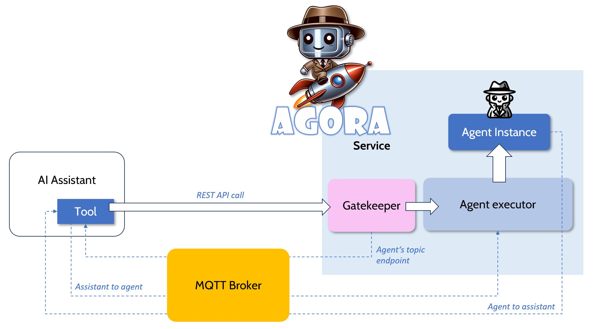

# Agora context

Agora is a agentic platform (runtime) which executes AI agents and enables them to collaborate in a closed environment.

## Agora service

An agora is a public or private API. Protection of this API is managed by a customer's API management system which is not part of the Agora framework.

## Agora instance

An agora service can host several agora instances. Each instance has different tools and states as set up in the agora manifest.

## Agent lifecycle

An agent is defined as a agent YAML manifest and can be send via API call to an Agora instance. The Agora service will execute the agent and promote it through the various lifecycle states (as defined in the finite state machine inside the agora manifest).

An agent has an defined start and end state. If the end state is reached the agent is removed from the agora.

## Human in the loop

### Interaction with the agent's owner

An agent is injected at runtime by the agora platform with a tool which enables communication with the sender via MQTT - from the outer perspective an agent instance behaves like a IoT device. 

It is assumed that the agent's human owner is using an AI assistant for multimodal communication. The AI assistant encapsulates the agent and the communication with the agora.

#### Agent to assistant communication

During the initial API call which deploys the agent to the agora the API call returns credentials and a MQTT endpoint/topic to which the assistant can subscribe. If the agent needs confirmation or a budget raise it sends an MQTT message in a custom format over this MQTT endpoint.

The MQTT protocol was chosen because of its ability to support online/offline scenarios.

#### Assistant to agent communication.

With the MQTT endpoint which was returned with the intial API call the assistant can communicate with the agent. The agora platform servie will listen to this endpoint, instanciate the agent and deliver the message as a prompt.

One use case for this kind of communication is to cancel the agent's mission.